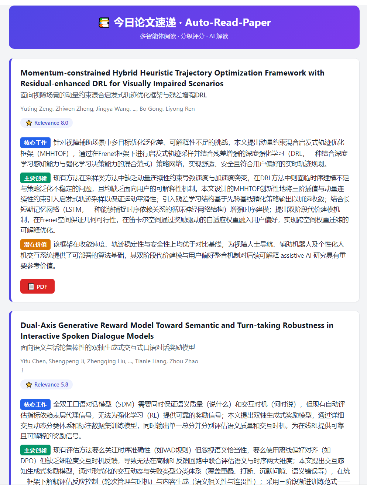
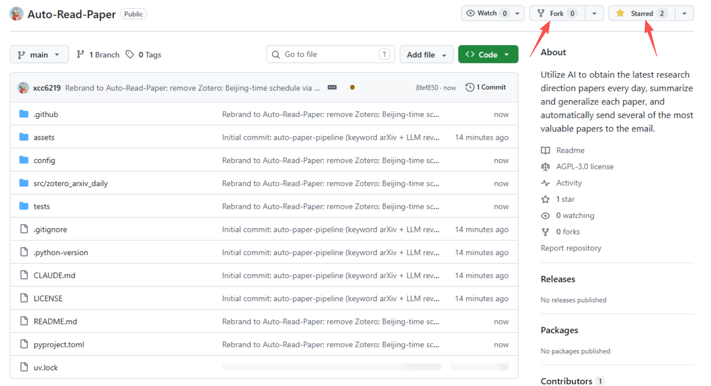
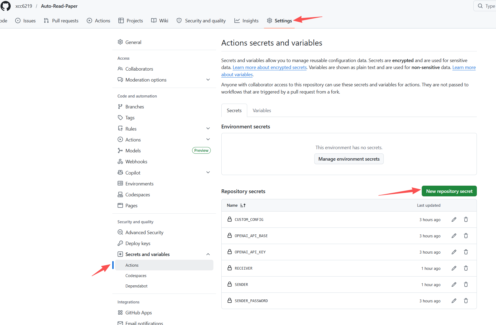
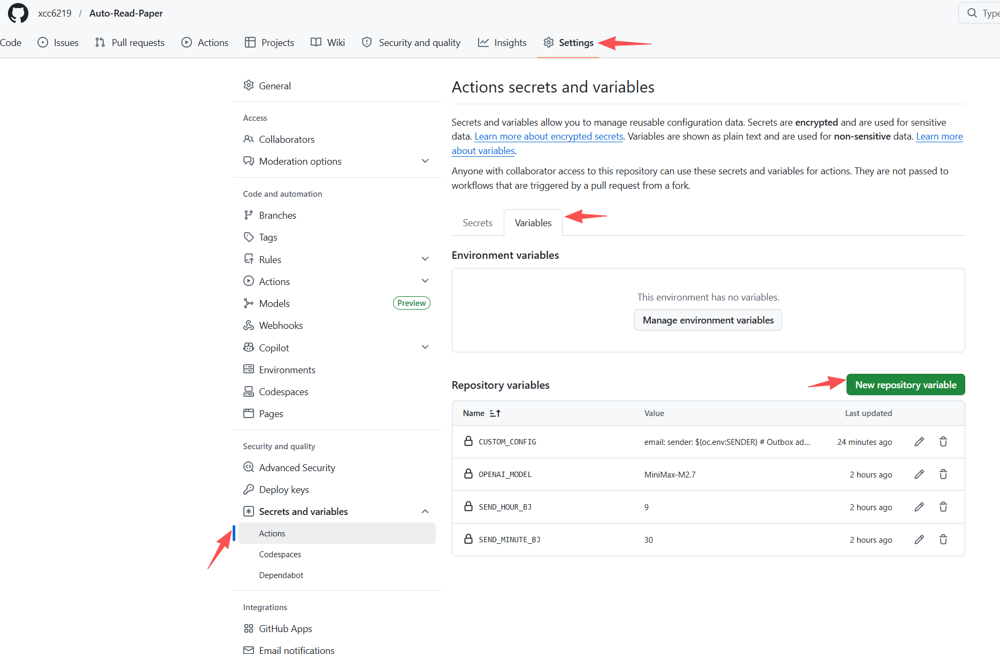
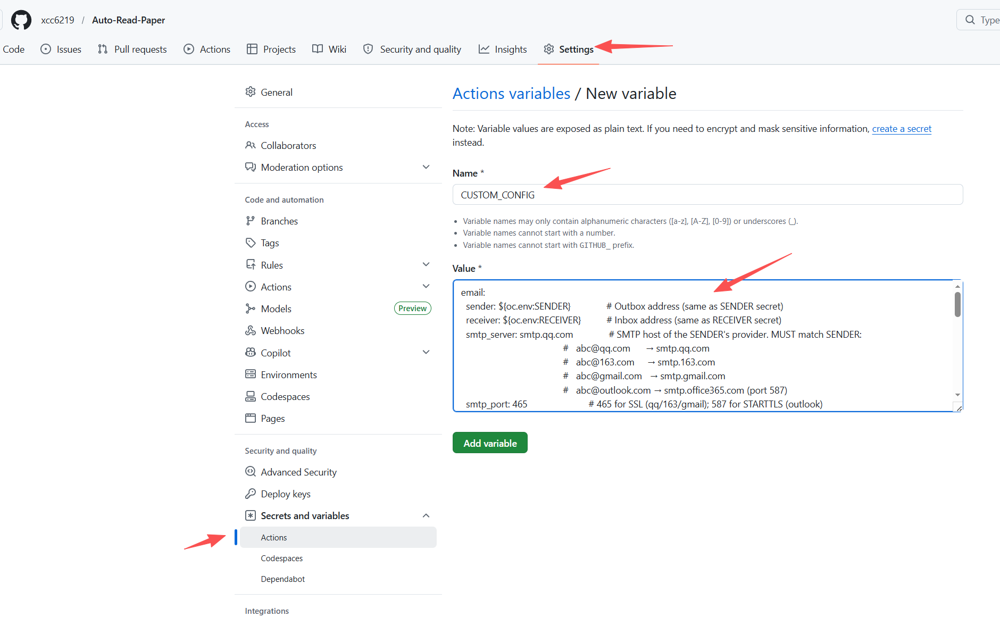
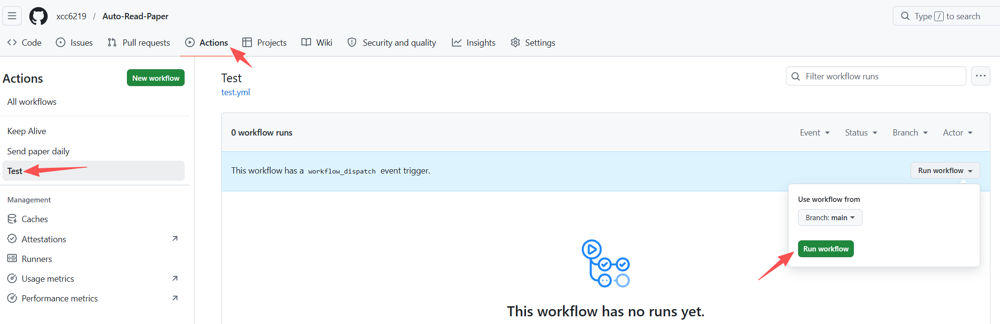
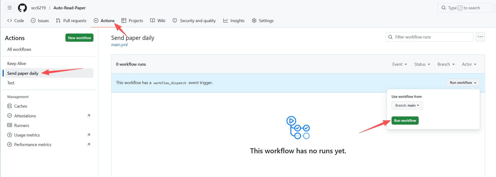
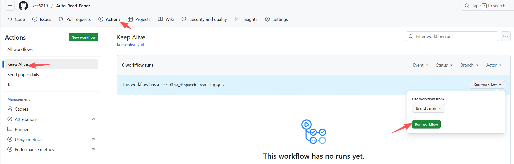
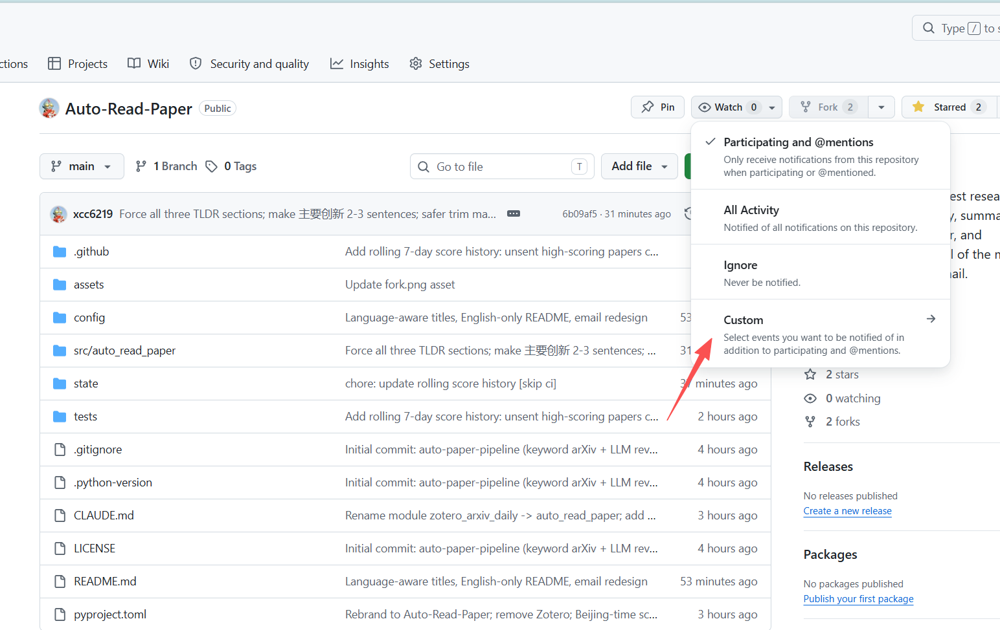

<p align="center">
  <a href="" rel="noopener">
 </a>
</p>

<h1 align="center">📚 Auto-Read-Paper</h1>

<div align="center">

  []()
  []()
  []()
  []()

</div>

---

<p align="center">
<b>Your personal AI paper-reading assistant</b> — automatically fetches fresh arXiv papers daily, runs a <b>multi-agent read-and-review pipeline</b>, remembers unsent high-scoring papers across days, and delivers a <b>bilingual digest with AI commentary</b> straight to your inbox.<br>
Runs entirely on GitHub Actions — <b>no server, free infra on public repos</b>. You only pay for the LLM API tokens your chosen provider bills (typically $0.01–$0.10 / day with gpt-4o-mini / DeepSeek-class models).
</p>

<p align="center"><a href="#-highlights">🌟 Highlights</a> · <a href="#-usage">🚀 Usage</a> · <a href="#-how-it-works">📖 How it works</a></p>

---

## 🌟 Highlights

> Not just a paper crawler — an AI that **reads, grades, picks, summarizes, and remembers** for you.

### 🤖 Multi-Agent Collaboration (core feature)

Unlike the common "score each paper in isolation" approach, Auto-Read-Paper ships with a **Reader + Reviewer two-agent pipeline** by default:

| Role | Responsibility | Output |
|---|---|---|
| 🧑‍🔬 **Reader** | Reads each paper's title, abstract, and a preview of the main body; extracts structured notes (task / method / contributions / results / limitations) | Compact JSON notes per paper |
| 🧐 **Reviewer** | Receives all Reader notes in a single batch, ranks papers globally on a multi-dimensional rubric (**novelty / soundness / effectiveness / completeness / reproducibility / trending**), produces a single 0-10 holistic score | Globally consistent ranking + scores |

**Why is this better than a single agent?**
- ✅ **Global calibration** — the Reviewer sees every candidate side-by-side, so scores don't drift the way they do when each paper is graded in isolation.
- ✅ **Token-efficient** — Reader does a light read per paper; Reviewer does one batched call. Far cheaper than per-paper scoring.
- ✅ **Sharper ranking** — structured notes let the grader focus on real technical differentiation instead of abstract wording.

💡 You can toggle single/multi-agent mode anytime in YAML: `executor.reranker: reader_reviewer` (default, multi-agent) or `keyword_llm` (single-agent, per-paper scoring).

### 📖 Automatic deep-reading & localized AI commentary

Each Top-N paper is **deep-read** — the full TeX / HTML / PDF is pulled and fed to the LLM to produce a structured summary in the language you configured (`llm.language` in YAML, default `Chinese`):

- 🎯 **Core work** — 1-2 sentences on the problem and approach
- 💡 **Key innovation** — 2-3 sentences on the pain point, the core idea, and how it differs from / improves on prior work
- 🚀 **Potential value** — 1-2 sentences on real-world impact and research value

🔤 **Acronym-friendly**: widely-used technical abbreviations (RL, MPC, RAG, LVLM, GRPO, …) are preserved in the original English, with a brief gloss in the target language on first use — so domain readers never lose context.

### 🧠 Long-term memory · 7-day rolling digest

High-scoring papers are **never buried**:

- 📥 Papers scored today but not sent → roll forward into the candidate pool
- 🔄 They re-compete tomorrow: on a quiet day, yesterday's "4th place" gets its turn
- 💾 State persists in `state/score_history.json`, auto-committed back to the repo after each run
- ⏰ Entries older than `retention_days` (default 7) are pruned to prevent backlog

**Result:** the daily email is never empty, and genuinely valuable papers always end up in front of you — eventually.

### 📧 Carefully designed email cards

- 📑 **Bilingual titles (auto)** — English original on top, plus a translation into `llm.language` underneath (smaller, subtle). When `llm.language` is set to `English`, the title stays single-line English only — no redundant translation.
- 🏷️ **Color-coded section pills** — the three summary sections are tagged in blue / green / orange
- ⭐ **Relevance score badge** — AI score visible at a glance
- 🎨 **Card layout** — accented left border, rounded corners, soft shadows; looks clean on both mobile and desktop



---

## ✨ Full feature list

- 🤖 **Single/multi-agent switchable** — multi-agent by default (Reader + Reviewer): token-efficient with global scoring
- 🧭 **Six-dimension scoring rubric** — Reviewer evaluates every paper on novelty / soundness / effectiveness / completeness / reproducibility / trending, then folds them into a calibrated 0-10 score
- 🧠 **7-day long-term memory** — rolling candidate pool ensures high-scoring papers aren't lost
- 📖 **Automatic full-text reading** — pulls TeX/HTML/PDF, not just abstracts
- 🌐 **Localized AI commentary** — three-section structured summary in the language you choose (`llm.language`); technical acronyms preserved
- 📑 **Smart bilingual titles** — English + translation in `llm.language`; automatically collapses to single-line English when language is set to English
- 🎨 **Beautiful email template** — colored tags, card layout, score badges
- ⏰ **Beijing-time schedule** — a single repo variable `SEND_HOUR_BJ` controls send time
- 🔍 **Keyword pre-filter** — papers not matching your keywords are dropped before any LLM call (saves tokens)
- 💰 **Free infra on public repos** — GitHub Actions minutes are unlimited for public repos; you only pay the LLM provider for tokens
- 🫀 **Heartbeat stability** — Keep-Alive workflow prevents GitHub from pausing cron after 60 idle days; history fallback + arXiv heartbeat keeps the daily pulse alive even on quiet days
- 🔧 **Hydra + OmegaConf** — every behavior is configurable via YAML with hot env-var interpolation

---

## 🚀 Usage

### Quick Start

1. **Fork this repo into your own GitHub account.**
   

2. **Set GitHub Action repository secrets.** They are invisible after saving, even to you.

   > **About Secrets vs Variables.** GitHub Actions exposes two kinds of repo-level configuration:
   > - **Secrets** (`${{ secrets.X }}`): encrypted, masked as `***` in logs, never readable after save. Use these for **anything sensitive** — passwords, API keys, SMTP auth codes.
   > - **Variables** (`${{ vars.X }}`): plain-text, visible in logs, editable any time. Use these for **non-sensitive config** — model id, schedule hour, feature toggles.
   >
   > Both live under repo **Settings → Secrets and variables → Actions** but in *separate tabs*. Neither is inherited when someone forks — every fork must set its own.

   

   | Key | Description | Example |
   | :--- | :--- | :--- |
   | `SENDER` | **The email account that SENDS the digest** (outbox). Needs SMTP access — usually the same as your login email. | `abc@qq.com` |
   | `SENDER_PASSWORD` | **SMTP auth code for `SENDER`** — a special password issued by the email provider for third-party SMTP clients. **NOT your webmail login password.** See "SMTP auth code how-to" below. | `abcdefghijklmn` |
   | `RECEIVER` | **The email account that RECEIVES the digest** (inbox). Can be any address, same provider or different, no SMTP setup needed. | `abc@outlook.com` |
   | `OPENAI_API_KEY` | API key for the LLM. Any OpenAI-compatible provider works (OpenAI, DeepSeek, SiliconFlow, Qwen, etc.). | `sk-xxx` |
   | `OPENAI_API_BASE` | Base URL of the LLM API. | `https://api.openai.com/v1` |

   > **Quick mental model** — there are three email-related values, don't mix them up:
   > - `SENDER` = **outbox address** (sends the mail). Needs a matching `SENDER_PASSWORD` auth code **and** a matching `smtp_server` / `smtp_port` in the YAML config below.
   > - `SENDER_PASSWORD` = **SMTP auth code of the SENDER** (not your regular password). Generated in the SENDER account's web settings.
   > - `RECEIVER` = **inbox address** (reads the mail). No credentials needed; just tells the SENDER where to deliver.
   >
   > `SENDER` and `RECEIVER` can be the **same address** (send-to-self is fine) or **different** providers (e.g. send via QQ, receive on Gmail). Only the SENDER side has SMTP credentials to set up.

   > **SMTP auth code how-to** — most providers disable plain-password SMTP for security. You must enable SMTP/IMAP in your email account's web settings, which then hands you a ~16-char auth code to paste into `SENDER_PASSWORD`:
   > - **QQ Mail (`smtp.qq.com:465`)**: Settings → Account → POP3/IMAP/SMTP → enable "IMAP/SMTP服务" → send the verification SMS → copy the 16-char 授权码.
   > - **163 / NetEase (`smtp.163.com:465`)**: 设置 → POP3/SMTP/IMAP → 开启 "IMAP/SMTP服务" → 授权码.
   > - **Gmail (`smtp.gmail.com:465`)**: enable 2-Step Verification → myaccount.google.com/apppasswords → create "App password" → copy the 16-char code (remove spaces).
   > - **Outlook / Office 365 (`smtp.office365.com:587`)**: enable 2FA → account.microsoft.com → Security → App passwords → generate. Note port 587 + STARTTLS differs from 465.
   >
   > If SMTP auth fails (`535 authentication failed` in the workflow log), nine times out of ten the auth code is wrong, expired, or contains pasted-in spaces. Re-issue and re-paste. The `SENDER` address and `smtp_server` must both belong to the same provider — `SENDER=abc@qq.com` + `smtp_server=smtp.163.com` will not work.

3. **Set GitHub Action repository variables** (Variables tab, *not* Secrets).
   

   | Variable | Description | Example |
   | :--- | :--- | :--- |
   | `SEND_HOUR_BJ` | Beijing hour (0-23) at which the daily email is sent. Default `7`. | `7` |
   | `SEND_MINUTE_BJ` | Beijing minute (0-59). Optional, default `0`. Rounded down to the nearest 5-minute bucket — GitHub cron drifts ~5-15 min so finer precision isn't realistic. | `30` |
   | `OPENAI_MODEL` | LLM model id used for both scoring and the deep-read summary. Any model your `OPENAI_API_BASE` provider serves. Default `gpt-4o-mini`. | `gpt-4o-mini`, `deepseek-chat`, `Qwen/Qwen2.5-72B-Instruct` |
   | `CUSTOM_CONFIG` | The full YAML configuration (see below). | *(multi-line YAML)* |

   

   Paste the following into `CUSTOM_CONFIG`, then edit `keywords` / `category` / `model` to your taste:

   ```yaml
   email:
     sender: ${oc.env:SENDER}              # Outbox address (same as SENDER secret)
     receiver: ${oc.env:RECEIVER}          # Inbox address (same as RECEIVER secret)
     smtp_server: smtp.qq.com              # SMTP host of the SENDER's provider. MUST match SENDER:
                                           #   abc@qq.com      → smtp.qq.com
                                           #   abc@163.com     → smtp.163.com
                                           #   abc@gmail.com   → smtp.gmail.com
                                           #   abc@outlook.com → smtp.office365.com (port 587)
     smtp_port: 465                        # 465 for SSL (qq/163/gmail); 587 for STARTTLS (outlook)
     sender_password: ${oc.env:SENDER_PASSWORD}   # SMTP auth code, NOT the webmail login password

   llm:
     api:
       key: ${oc.env:OPENAI_API_KEY}
       base_url: ${oc.env:OPENAI_API_BASE}
     generation_kwargs:
       model: ${oc.env:OPENAI_MODEL,gpt-4o-mini}  # Picks up the OPENAI_MODEL repo variable
     language: Chinese

   source:
     arxiv:
       category: ["cs.AI","cs.LG","cs.RO"] # Coarse arXiv category filter
       include_cross_list: true
       keywords:                            # Fine-grained keyword filter (case-insensitive)
         - "reinforcement learning"
         - "model predictive control"
         - "residual policy"

   executor:
     debug: ${oc.env:DEBUG,null}
     send_empty: false
     max_paper_num: 10                     # Top-N papers shown in the email
     source: ['arxiv']
     # reader_reviewer = 多智能体 (Reader + Reviewer, 默认, 推荐)
     # keyword_llm     = 单智能体 (逐篇 LLM 打分)
     reranker: reader_reviewer
   ```

   > `${oc.env:XXX,yyy}` resolves to environment variable `XXX`, falling back to `yyy` when unset.

4. **Run the `Test` workflow first — smoke-check that secrets/vars load and dependencies build.**
   

5. **Once `Test` passes, manually trigger `Send paper daily` for a live dry-run.** Check the workflow log and your inbox.
   

   After this manual run, the workflow also runs automatically — the job wakes up every 5 minutes, but only sends an email when the **Beijing time matches `SEND_HOUR_BJ`:`SEND_MINUTE_BJ`** (default 07:00 Beijing time, rounded down to a 5-minute bucket). Change the variables anytime to reschedule; no YAML edit needed.

6. **Keep it running 365 days.** Two GitHub-side issues can silently kill the daily digest; both are handled by default, but you should know what's happening:

   - **60-day idle pause.** GitHub disables schedule triggers on any repo with no recent commits or activity. The bundled `Keep Alive` workflow touches `keep-alive.txt` every 30 days specifically to prevent this. Leave it enabled and no action is ever needed.
     

   - **Actions minute quota.** See the next subsection for the full breakdown. TL;DR: **public forks = unlimited and free forever**; private forks need a stricter cron.

7. **(Optional) Subscribe to failure emails.** Click the repo's **Watch** button → *Custom* → tick **Actions** — GitHub will email you only when a workflow fails, so you hear about an expired API key or SMTP rejection within minutes instead of noticing a silent empty inbox days later.
   

### ⚖️ Will this burn through my GitHub Actions quota?

Short answer: **No — as long as your fork is a public repo, both workflows (`Send paper daily` + `Keep Alive`) run free forever, every day of the year.** This is the intended deployment target.

The details GitHub actually bills on:

| Your fork is… | Actions minutes | Storage | Verdict |
| :--- | :--- | :--- | :--- |
| **Public** (default when you fork) | **Unlimited & free** | Unlimited & free | ✅ 365-day operation, zero infra cost. Just keep the LLM API key funded. |
| **Private** | 2000 min/month free (Free plan), 3000 (Pro) | 500 MB / 1 GB | ⚠ Default `*/5 * * * *` cron = ~8640 wakeups/month; even though most skip in under 10 s, GitHub rounds every invocation up to **1 billed minute**, so you will blow the 2000-min cap by mid-month. Switch the cron (table below). |

The `Keep Alive` workflow runs once every 30 days — ~12 invocations/year — so its cost is negligible on any plan. The quota pressure is entirely from `Send paper daily`'s cron.

**Cron presets for private forks** — edit `.github/workflows/main.yml` and change the `- cron:` line. The in-job Beijing-time bucket check still decides whether to actually send, so narrowing the cron only reduces how often the runner wakes up.

| Cron | Wakeups/month | Est. billed min/month | Use when |
| :--- | :--- | :--- | :--- |
| `'*/5 * * * *'` (default) | ~8640 | ~8640 ⚠ way over private quota | public repo |
| `'*/15 * * * *'` | ~2880 | ~2880 ⚠ still over | marginal |
| `'*/30 * * * *'` | ~1440 | ~1440 ✅ | private, 30-min send precision |
| `'*/5 22-23,0-2 * * *'` | ~1800 | ~1800 ✅ | private, keep 5-min precision but only wake during BJ 06–10 window |
| `'0 23 * * *'` (single daily fire) | ~30 | ~30 ✅ | private, one shot at BJ 07:00 sharp (tolerant to cron drift) |

If you fork to a public repo — which is what we recommend — ignore this table and keep the default cron.

### Full configuration reference

See [config/base.yaml](config/base.yaml) for every available knob, including:
- `executor.reranker` — pick `keyword_llm` (per-paper LLM scoring, simple) or `reader_reviewer` (two-agent: Reader takes structured notes per paper, Reviewer batch-ranks them in one call).
- `reranker.keyword_llm.weights` — reweight innovation/relevance/potential.
- `reranker.keyword_llm.threshold` / `reranker.reader_reviewer.threshold` — drop papers below a minimum score.
- `reranker.keyword_llm.concurrency` / `reranker.reader_reviewer.concurrency` — parallel LLM requests.
- `reranker.reader_reviewer.reviewer_max_papers` — cap how many papers go into the single Reviewer batch call.
- `source.arxiv.include_cross_list` — include cross-listed papers.
- `executor.send_empty` — still send the email even when no paper matched.
- `history.enabled` / `history.retention_days` — keep a rolling pool of scored-but-unsent papers for N days so the highest-scoring backlog gets surfaced.

### Local Running

Powered by [uv](https://github.com/astral-sh/uv):
```bash
# export SENDER=... SENDER_PASSWORD=... RECEIVER=...
# export OPENAI_API_KEY=... OPENAI_API_BASE=...
cd Auto-Read-Paper
uv sync
DEBUG=true uv run src/auto_read_paper/main.py
```

## 📖 How it works

```
arXiv RSS → keyword filter → multi-agent rerank → history merge → Top-N deep read → email
                                      ↓
                      Reader (structured notes) + Reviewer (global scoring)
```

1. **Retrieve** — pull newly-announced papers in the configured categories from arXiv RSS every day
2. **Keyword pre-filter** — drop papers whose title/abstract doesn't match any keyword (before any LLM call)
3. **Multi-agent rerank (default)** —
   - 🧑‍🔬 **Reader**: reads title + abstract + main-body preview per paper, emits structured JSON notes
   - 🧐 **Reviewer**: compares all candidates side-by-side in a single call and scores each 0-10 on innovation / relevance / impact
4. **History merge** — today's scored papers merge with the past-7-days unsent pool; everything is re-sorted by score
5. **Deep read** — the Top-N go back to the LLM to produce the three-section summary (in the language set via `llm.language`) and, when that language differs from English, a translated title
6. **Render & send** — HTML template renders colored cards and sends via SMTP; papers are only marked as sent **after** SMTP succeeds

## 📌 Limitations

- arXiv RSS is the only source. Google Scholar has no stable API and would not survive on GitHub Actions runners.
- The LLM scoring is only as good as the prompt + model; for niche domains, expect some noise. Raise `max_paper_num` or tune `weights` to taste.
- Runs **free and unmetered on a public fork**; private forks need a stricter cron — see ["Will this burn through my GitHub Actions quota?"](#-will-this-burn-through-my-github-actions-quota) above.

---

## 📃 License

Distributed under the AGPLv3 License. See `LICENSE` for detail.

## ❤️ Acknowledgement

This project stands on the shoulders of two open-source projects:

- [**TideDra/zotero-arxiv-daily**](https://github.com/TideDra/zotero-arxiv-daily) — the GitHub Actions + SMTP + HTML email foundation that this repo forks and extends.
- [**ReadPaperEveryday**](https://github.com/) — inspired the keyword-based arXiv workflow and Chinese deep-read summarization style.

Additional thanks to:
- [arxiv](https://github.com/lukasschwab/arxiv.py)
- [trafilatura](https://github.com/adbar/trafilatura)
- [pymupdf4llm](https://github.com/pymupdf/PyMuPDF)
